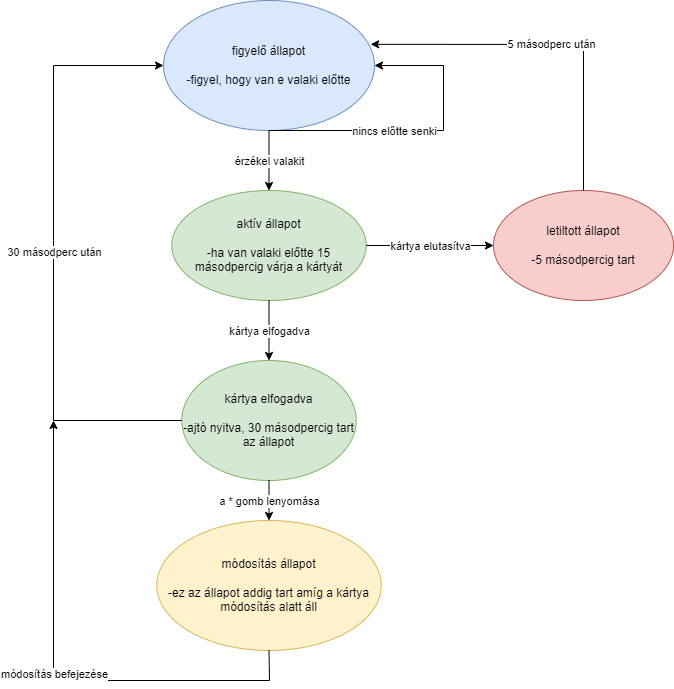

## 1. Áttekintés
A projekt célja, hogy egy működőképes beléptető rendszer valósuljon meg. A projekt funkcióját tekintve képes a használóját beléptetni az adott ajtón, a megfelelő NFC
kóddal rendelkező tárgyat használva és képes belépni az adott helységbe. Megkönnyíti az azonosítást és csak azok léphetnek be akiknek hatáskörük engedi, illetéktelen
személyek képtelen belépni. A NFC tárgy beolvasása után a belépéshez tartozik egy időkorlát, illetve képes a tulajdonos megszerkeszteni a kódot, ha a kód
megszerkesztése mellett dönt utána indul az időkorlát.

## 2. Jelenlegi helyzet
A megrendelő egy olyan programot szeretne, ami segíti őt a helységbe való belépésben és azonosításban. Ezt egy Arduino projekt segítségével képzeli el, hiszen ez egy
olcsón létrehozható és mindemellett egy hasznos projekt . A bemeneti adatokat egy NFC olvasó segítségével kapjuk meg, mivel az könnyen olvasható/módosítható. Fontos
számára, hogy a  beléptető rendszer teljesen jól és pontosan működjön . Emellett a megrendelő igényli a menüben történő beállításokat, módosítások könnyed és egyszerű
kezelését, ezeket a feltételeket nyugodt szívvel tudjuk biztosítani. 

## 3. Követelménylista
        3.1 Figyelő állapotban az érzékelő megfelelően jelezzen,hogy állnak-e előtte,vagy sem.
        3.2 Aktív állapotban kártya érzékelése esetén döntse el a rendszer,hogy a felhasználó által használt kártya jogosult-e az ajtó nyitására.
                3.2.1 Kártya elfogadása esetén nyissa ki az ajtót, illetve biztosítson lehetőséget módosító állapot eléréséhez.
        3.3 Elutasítás esetén kerüljön 5 másodpercre letiltott állapotba.

## 4. Jelenlegi üzleti folyamatok modellje

## 5. Igényelt üzleti folyamatok modellje
    5.1 érzékelve van valaki az ajtó előtt
        5.1.1 kártyát elfogadja a rendszer
                5.1.1.1 a nyitva állapot ideje letelik
                5.1.1.2 a * gomb lenyomása
                        5.1.1.2.1 módosítás
                        5.1.1.2.2 módosítás befejezése
        5.1.2 a kártyát elutasítja a rendszer
                5.1.2.1 letiltott állapot
    5.2 nincs érzékelve senki az ajtó előtt
        5.2.1 vár, hogy valakit érzékeljen
    
## 6. Használati esetek
        6.1 Az eszköz által érzékelt személy használja a kártyáját.
                6.1.1 A használt kártyát a rendszer elfogadja 
                        6.1.1.1 Az ajtó kinyílik
                        6.1.1.2 A * gomb megnyomása esetén módosítás állapotba lépünk.
                                6.1.1.2.1 A módosítás befejezése után a rendszer figyelő állapotba kerül.
                6.1.2 A használt kártyát a rendszer elutasítja
                        6.1.2.1 A rendszer 5 mp-re letiltott állapotba kerül.

## 7. Forgatókönyv

## 8. Fogalomszótár
